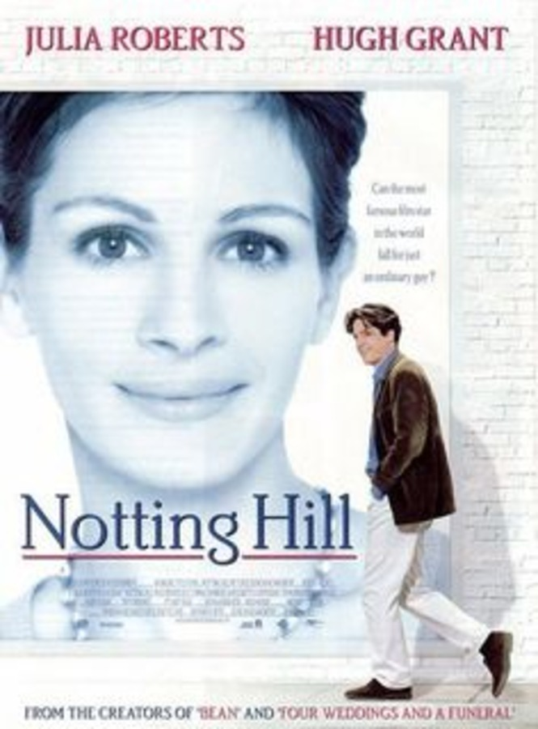
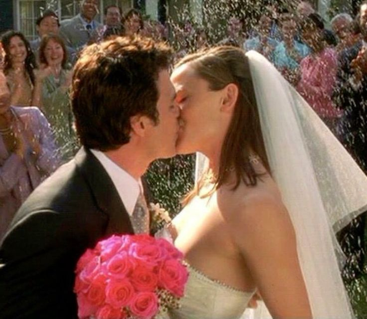
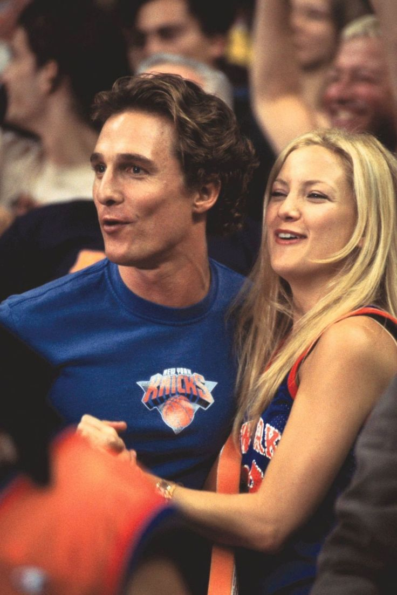
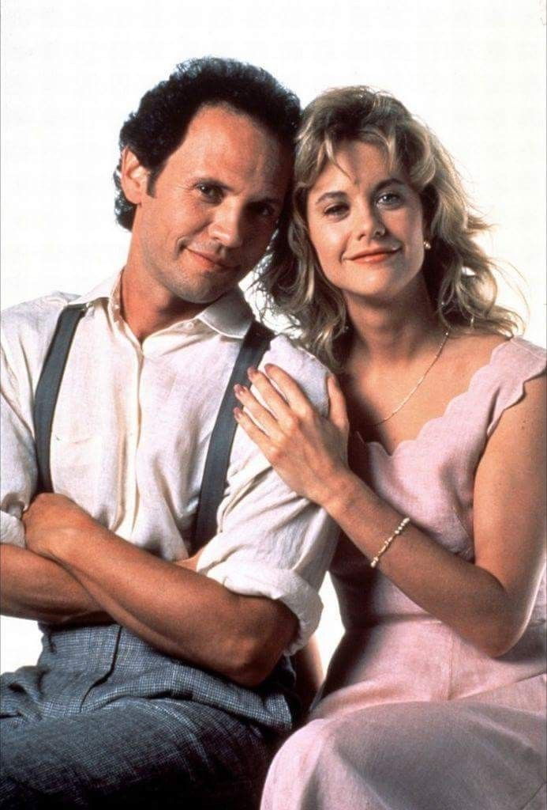
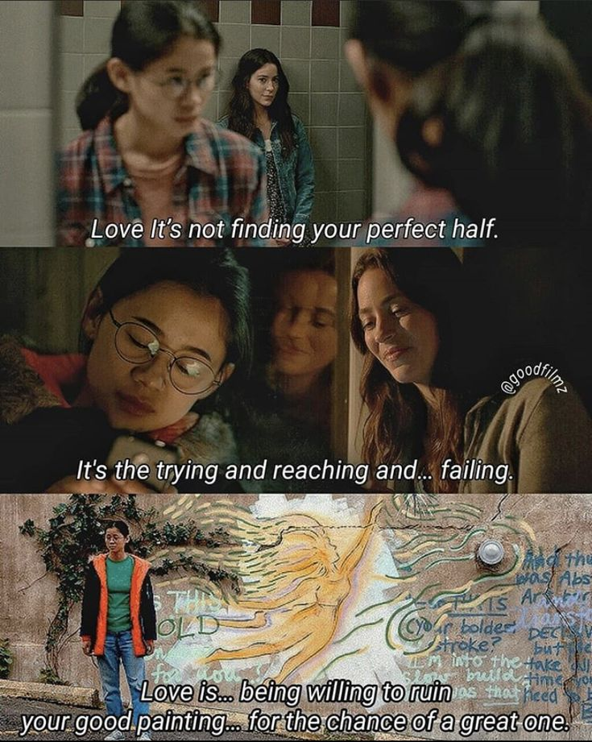
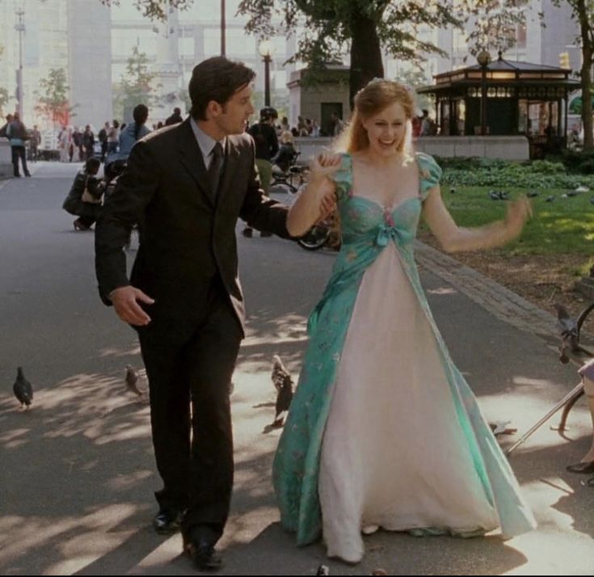

### "I’m just a person standing in front of a screen, asking you to fall in love with stories."

 **Want a perfect blend of love and laughter? Capture the magic of falling in love while reminding us not to take life too seriously. Whether it’s a quirky meet-cute, heartwarming grand gestures, or hilarious misunderstandings, rom-coms show us that love can be both messy and beautiful—and that a little humor always helps along the way.**

---

### Here are the Top 10 Romcom Movies to Watch

### 1. Nothing Hill (1999)

### Sypnosis:
Notting Hill is a charming romantic comedy set in the heart of London's vibrant Notting Hill district. The story follows William Thacker, a humble bookstore owner, whose life takes an unexpected turn when he encounters Anna Scott, a world-famous movie star. Despite their vastly different worlds, a heartfelt and often humorous romance blossoms between them, challenged by the realities of fame and ordinary life. With witty dialogue, unforgettable moments, and a touch of British charm, Notting Hill beautifully captures the magic of finding love in the most unlikely places.

### Famous Line:

### Rating System:
### 5 out of 5 
⭐️⭐️⭐️⭐️⭐️ (5/5)
Meet-Cutes

---

### 2.Crazy Rich Asians (2018)

### Sypnosis:
a dazzling romantic comedy that delves into the glamorous world of Singapore's elite. The story follows Rachel Chu, a smart and independent New Yorker, as she accompanies her boyfriend, Nick Young, to his best friend's wedding in Singapore. Unbeknownst to Rachel, Nick belongs to one of the wealthiest and most influential families in Asia. Thrust into a world of opulence, family drama, and cultural expectations, Rachel must navigate the challenges of love, identity, and acceptance. Filled with humor, heart, and stunning visuals, Crazy Rich Asians is a celebration of love, family, and cultural heritage.
### Famous Line:

### Rating System:
### 5 out of 5 
⭐️⭐️⭐️⭐️⭐️ (5/5)
A dazzling love story with opulent visuals, sharp humor, and heartfelt family drama. A modern classic that blends romance, culture, and comedy seamlessly.

---
### 3. 13 Going on 30 (2004)

### Sypnosis:
13 Going on 30 is a heartwarming and magical romantic comedy about learning to appreciate life’s moments. Jenna Rink, a 13-year-old girl yearning to fit in, makes a wish to be "thirty, flirty, and thriving" after a disastrous birthday party. The next morning, she wakes up as a 30-year-old woman living her dream life as a successful magazine editor in New York City. However, Jenna soon realizes that adult life isn’t as perfect as she imagined and reconnects with her childhood best friend, Matt, to rediscover what truly matters. Packed with humor, nostalgia, and heartfelt moments, 13 Going on 30 is a delightful tale of self-discovery and second chances.

### Famous Line:

### Rating System:
### 4 out of 5
⭐️⭐️⭐️⭐️ (4/5) 
A charming tale of self-discovery with a sprinkle of magic and nostalgia. Jennifer Garner shines as a 13-year-old trapped in a 30-year-old's body—both hilarious and heartwarming.

---
### 4. Set it Up (2018)

### Sypnosis:
In this witty and modern romantic comedy, two overworked assistants, Harper and Charlie, devise a plan to set up their demanding bosses in hopes of lightening their workloads. As their matchmaking scheme unfolds, unexpected sparks fly, and the duo begins to realize they might be setting up more than just their bosses. Set It Up is a fun and refreshing take on love and ambition.

### Famous Line:

### Rating System:
### 5 out of 5 
⭐️⭐️⭐️⭐️ (4/5)
A refreshing, feel-good rom-com about matchmaking gone hilariously wrong. The chemistry between Zoey Deutch and Glen Powell is top-tier.

---
### 5. How to Lose a Guy in 10 Days (2003)

### Sypnosis:
This hilarious romantic comedy pits Andie Anderson, a magazine writer tasked with driving a man away in 10 days, against Benjamin Barry, an ad exec who bets he can make any woman fall in love with him within the same timeframe. As their opposing agendas collide, their unexpected chemistry leads to laugh-out-loud moments and a surprising twist on modern romance.

### Famous Line:

### Rating System:
### 5 out of 5 
⭐️⭐️⭐️⭐️ (4/5)
A rom-com staple with witty banter, a ridiculous yet delightful premise, and undeniable chemistry between Kate Hudson and Matthew McConaughey.

---
### 6. Pretty Woman (1990)

### Sypnosis:
This iconic romantic comedy tells the story of Vivian Ward, a spirited and independent escort, who crosses paths with Edward Lewis, a wealthy businessman in need of a companion for social events. As their unlikely relationship evolves, they challenge each other’s perspectives on life and love in this heartfelt and glamorous tale of transformation and connection

### Famous Line:

### Rating System:
### 5 out of 5 
⭐️⭐️⭐️⭐️⭐️ (5/5)
A timeless rom-com about love transcending societal norms, anchored by the sparkling chemistry between Julia Roberts and Richard Gere. The ultimate “Cinderella” story.

---
### 7. When Harry Met Sally (1989)

### Sypnosis:
Exploring the timeless question, "Can men and women ever just be friends?" this romantic comedy follows Harry and Sally over the course of 12 years as their friendship grows and deepens. Packed with witty dialogue, memorable moments, and honest reflections on relationships, When Harry Met Sally remains a classic exploration of love and friendship.

### Famous Line:

### Rating System:
### 5 out of 5 
⭐️⭐️⭐️⭐️⭐️ (5/5)
A witty, heartfelt exploration of friendship and love with memorable performances from Billy Crystal and Meg Ryan. A genre-defining masterpiece.

---
### 8. The Half of It (2020)

### Sypnosis:
In this heartfelt coming-of-age story, Ellie Chu, a shy and intelligent student, agrees to help a jock, Paul, write love letters to his crush, Aster. As Ellie develops feelings for Aster herself, the trio embarks on an emotional journey of love, identity, and self-discovery. The Half of It is a fresh and poignant story about finding connection in unexpected ways.

### Famous Line:

### Rating System:
### 5 out of 5 
⭐️⭐️⭐️⭐️ (4/5)
A modern, coming-of-age rom-com that breaks the mold. A touching story about unrequited love, identity, and friendship that’s as sweet as it is poignant.

---
### 9. Enchanted (2007)

### Sypnosis:
This whimsical Disney tale follows Giselle, a fairytale princess banished from her magical animated kingdom to modern-day New York City. As she adjusts to the real world, Giselle discovers that true love might not always come in the form of a "happily ever after." With humor, charm, and music, Enchanted is a magical adventure that blends fantasy and reality.

### Famous Line:

### Rating System:
### 5 out of 5 
⭐️⭐️⭐️⭐️⭐️ (5/5)
A delightful blend of fairy-tale magic and real-world romance, with Amy Adams giving a pitch-perfect performance as the lovable Giselle. Whimsical, funny, and endlessly enchanting.
---

### 10. Love, Simon (2018)

### Sypnosis:
Love, Simon is a heartfelt coming-of-age story about Simon Spier, a high school student with a big secret—he’s gay, and no one knows. When his anonymous online correspondence with another closeted student is discovered, Simon must navigate the challenges of coming out, finding love, and staying true to himself. With humor, honesty, and an inspiring message of acceptance, Love, Simon beautifully celebrates the power of love and self-discovery.

### Famous Line:

### Rating System:
### 5 out of 5 
⭐️⭐️⭐️⭐️⭐️ (5/5)

A heartfelt and groundbreaking rom-com that beautifully captures the struggles and triumphs of coming out and finding love as a teenager. With a charming lead performance by Nick Robinson, relatable humor, and an uplifting message, Love, Simon is a modern classic that will leave you smiling and inspired.

---

